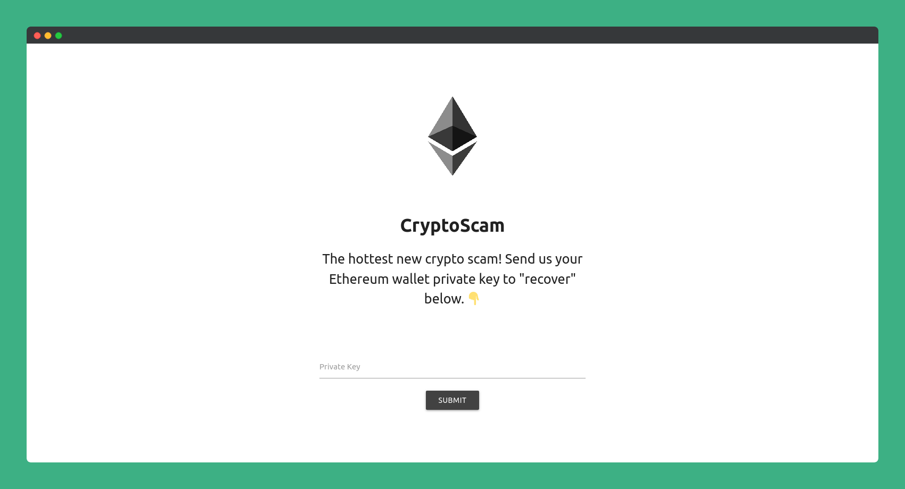

# Crypto Scam Mockup Webpage
This repository contains code for a mockup cryptocurrency scamming website, as [showcased in an OWASP Zap demonstration on Hak5](https://youtube.com/Hak5).

<p align="center">
  
  <br>
  <b>Mockup CryptoScam Site.</b>
  <br>
  <br>
</p>

### About
This application demonstrates the weakness of improper user input validation, since the "private wallet keys" are only validated on the client side via `index.html`.  
By creating a raw `POST` request to `process.php`, we can bypass the validation and spam a server with fake cryptocurrency private keys, as well as the [entire bee movie script]().

### Setup Guide
To follow this setup guide you'll need a Linux computer (we used a Raspberry Pi).

First start by installing the Nginx webserver, and PHP language.
```
sudo apt install nginx 
sudo apt install php-fpm php-mysql
```
Next, update your Nginx configuration file with  
`sudo nano /etc/nginx/sites-available/default`

Uppdate the default website block by changing the following parameters:
``` 
server {
	listen 80 default_server;
	listen [::]:80 default_server;

    # website file location
	root /var/www/html/Crypto-Scam-Mockup/;
    
	index index.html index.htm index.nginx-debian.html index.php;

	server_name _;

	location / {
		try_files $uri $uri/ =404;
	}

	location ~ \.php$ {
		include snippets/fastcgi-php.conf;
		fastcgi_pass unix:/var/run/php/php7.4-fpm.sock;
	}

	location ~ /\.ht {
		deny all;
	}
}
```
Finally, reload Nginx with  
`sudo service nginx reload`

You should now be able to view the website in a browser at `localhost` from your device, or from its ip address!  You can find the ip address by running `ifconfig`.

### Walkthrough
Walkthrough will be posted soon.